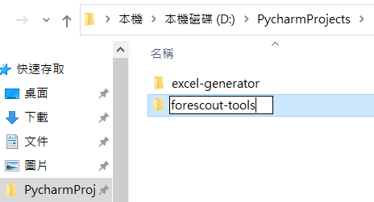
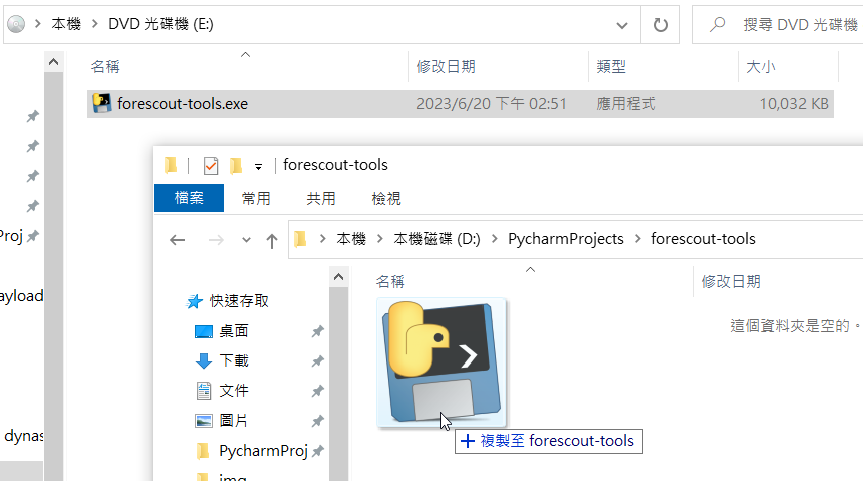
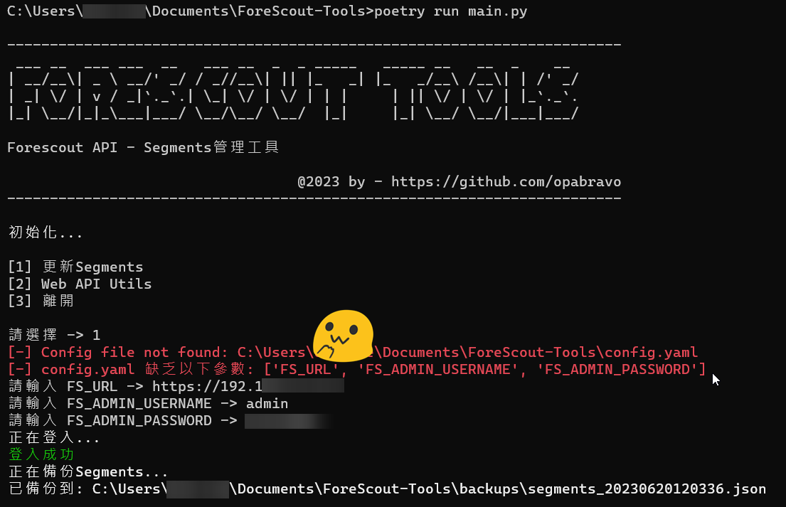
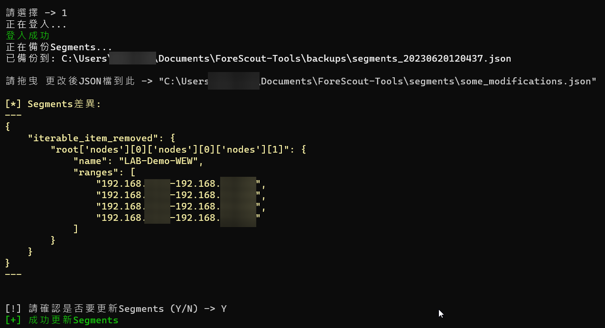
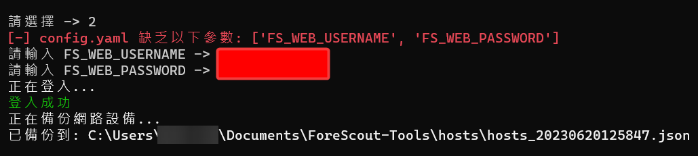

# ForeScout Tools

> This repository contains a collection of tools that can be used to interact with the ForeScout API.

## Functions

- Backup and modify network segments policies
- Backup hosts data

## How to use

### Use compiled binary

Download the latest release from [here](https://github.com/opabravo/ForeScout-Tools/releases/download/1.0/forescout-tools.iso)

Open `forescout-tools.iso`

Make a `forescout-tools` folder on your disk



Copy the `forescout-tools.exe` from DVD(iso) to the folder



Run it

### Run from source code

#### Requirements

- [Python 3.11+](https://www.python.org/downloads/)
- [Poetry](https://python-poetry.org/docs/#installation)

#### Install dependencies

```bash
git clone https://github.com/opabravo/forescout-tools
cd forescout-tools
poetry install
poetry run python main.py
```

## Usage

This will open up a menu

```bash
C:>poetry run main.py

------------------------------------------------------------------------
 ___ __  ___ ___  __   ___ __  _  _ _____   _____ __   __  _    __
| __/__\| _ \ __/' _/ / _//__\| || |_   _| |_   _/__\ /__\| | /' _/
| _| \/ | v / _|`._`.| \_| \/ | \/ | | |     | || \/ | \/ | |_`._`.
|_| \__/|_|_\___|___/ \__/\__/ \__/  |_|     |_| \__/ \__/|___|___/

Forescout API - Segments management tool

                  @2023 by - https://github.com/opabravo/forescout-tools
------------------------------------------------------------------------

初始化...

[1] Update Segments
[2] Web API Utils
[3] Exit

Select ->
```

### Backup and modify network segments policies





### Backup hosts data



### Config fields description

| Field | Description |
| --- | --- |
| `FS_URL` | Forescout API's Base URL, Eample Format : `https://192.168.1.1` |
| `FS_ADMIN_USERNAME` | Forescout Admin API's Username (Usually the default is `admin`)|
| `FS_ADMIN_PASSWORD` | Forescout Admin API's Password (Usually same as the password for forescout enterprise manager)|
| `FS_WEB_USERNAME` | Forescout Web API Username (Sould be set in `forescout -> options -> Web API`) |
| `FS_WEB_PASSWORD` | Forescout Web API Password (Sould be set in `forescout -> options -> Web API`) |

## QAs

### How to edit the config?

Edit the `config.yaml` file

## License

[MIT](LICENSE)
